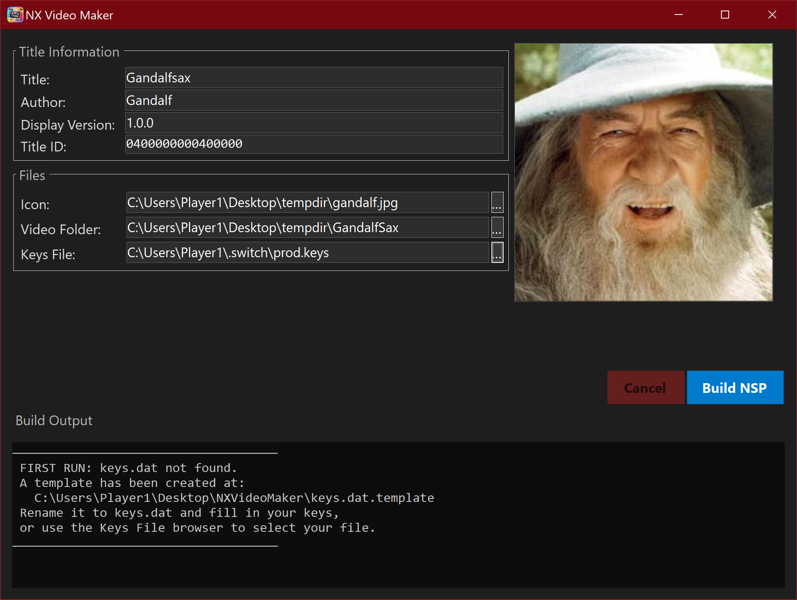
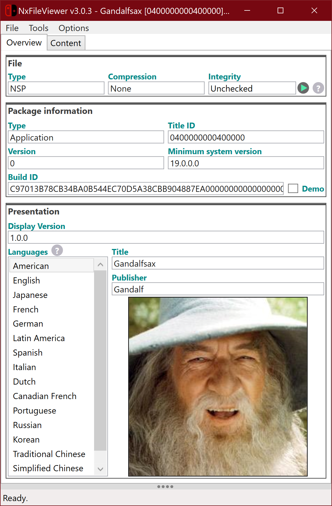

# NX Video Maker

A Windows GUI for building Nintendo Switch NSP titles that play video directly through the system's built-in offline web applet. Fill in your title info, point it at your files, hit **Build NSP** — done.

> Requires a Nintendo Switch running custom firmware.

---

## Screenshots

<!-- TODO: Add screenshots -->
| Main Window | Build Output |
|---|---|
|  |  |

---

## How It Works

The built NSP contains three NCAs:

- **Program NCA** — a minimal binary that configures and launches the system offline web applet.
- **Manual NCA** — contains your `index.html` with videos, or a single `video.mp4`, inside the required romfs structure.
- **Control NCA** — title metadata, icon, and display name.

The build process automatically selects the correct boot mode:
- A **video folder** containing `index.html` boots into web-applet mode — ideal for TV series or multiple videos. Exiting a video returns to the index page.
- A **video folder** containing `video.mp4` boots directly into the media player, which auto-closes when the video finishes and returns to the Switch home menu.

---

## Usage

### 1. Fill in Title Information

| Field | Description |
|---|---|
| **Title** | Display name shown on the Switch home menu |
| **Author** | Author name shown in title info |
| **Display Version** | Version string shown in title info (e.g. `1.0.0`) |
| **Title ID** | Unique 16-character hex ID (e.g. `0500000000400000`) — see [Title ID notes](#title-id-notes) below |

### 2. Select Files

| Field | Description |
|---|---|
| **Icon** | 256×256 JPG image shown on the Switch home menu |
| **Video Folder** | Folder containing either `index.html` (+ videos) or `video.mp4` |
| **Keys File** | Your `keys.dat` containing valid Switch crypto keys (not included) |

### 3. Build

Click **Build NSP**. Output will be placed next to the app. The log panel shows progress and any errors.

---

## Video Requirements

| Property | Value |
|---|---|
| Container | MP4 |
| Video codec | H.264 (AVC) |
| Resolution | 1280×720 |
| Frame rate | 30 fps |
| Audio codec | AAC (mp4a) |
| Audio channels | Stereo |
| Sample rate | 48000 Hz |

---

## Title ID Notes

- **`010000000000XXXX`** — Nintendo system titles and applets. **Do not use.**
- **`0100XXXXXXXXXXXX0000`** — Switch 1 retail games (eShop titles). **Do not use.**
- **`0400XXXXXXXXXXXX0000`** — Switch 2 retail games. Avoid on Switch 1 CFW if possible.
- **`05XXXXXXXXXXXXXX0000`** — Community homebrew convention. **Safe to use — recommended.**
- Other ranges (`0200`, `0300`, `0600`–`0F00`) are undocumented and likely reserved.

**Format rules:**
- Title IDs must end in `Y000` where `Y` is an **even** hex digit for a base application.
- Setting the `0x800` bitmask makes it an update title for the same base ID.
- An **odd** `Y` digit designates a DLC.

Before using a homebrew Title ID, check it against the community registry to avoid conflicts with other released homebrew:
[https://wiki.gbatemp.net/wiki/List_of_Switch_homebrew_titleID](https://wiki.gbatemp.net/wiki/List_of_Switch_homebrew_titleID)

---

## Keys

`keys.dat` must contain valid Nintendo Switch crypto keys and is **not included**. You can select your keys file using the **Keys File** browser in the app, or place it in the same folder as the executable and it will be picked up automatically on first run.

---

## Related

- [Nintendo Switch Video Player NSP](https://github.com/SuperOkazaki/HTML-Video-Template-NX) — the HTML video template this tool builds against
